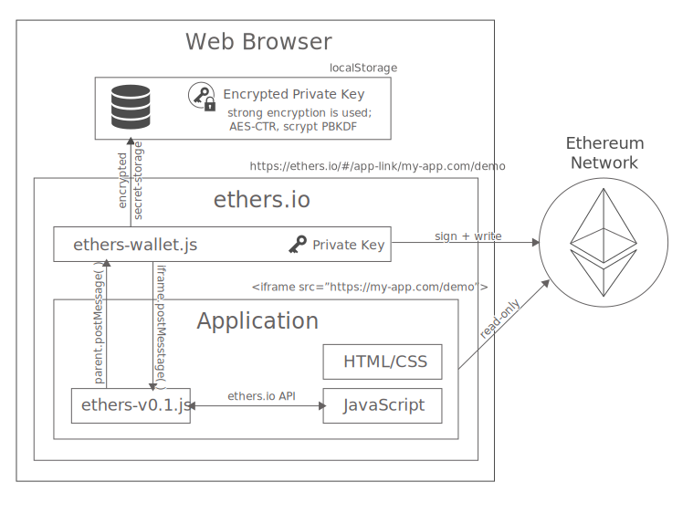

Overview
********

This overview is intended for developers who wish to create Ethereum
distributed applications (dapps) using Ethers.

Ethers applications live inside an container (iframe) which sandboxes them
from each other and from private data (such as private keys).

For read-only operations the application connect to the Ethereum blockchain
directly.

For writing to the blockchain, the application passes the transaction to
the container and relinquishes control of the application. Once the user has
confirmed (or denied) the transaction, control is returned to the
application and a copy of the transaction is passed to it.

The `Ethers App Library`_ handles all this interaction for you and provides
the :ref:`high-level API <dev-api>` you will likely require.

-----

Sandbox Architecture
====================

Applications are isolated in their own sandbox by running in an **iframe**,
each hosted on a separate domain, ensuring that a browser's cross-origin
policies will protect each application's state from another application's
state as well as the Ethers container.

Private Key
    The private key **NEVER** leaves the secure Ethers container and is
    never sent to any server nor shared with any application.

Secure Communication and Storage
    All applications should run on a separate domain, ensuring the only 
    communication between Ethers and the application occurs over the
    `Window postMessage API`_. This also ensures the localStorage of an
    application cannot access the Ethers container localStorage.
    If you are hosting multiple applications on the same domain, keep in 
    mind they will share a localStorage.

URL Privacy
    The Ethers container loads the URL indicated in the fragment (part
    after the hash) into the iframe. Since `a fragment is never sent to the server`_
    this remains private even from Ethers. Only the end applcation knows it
    was loaded.

Applications
    An application can be written in any web technology. It may be a single static
    page, a single page with a backend AJAX responder, or a multi-page site. There
    are no restrictions, as long as pages that need to interact with Ethers are
    served over HTTPS.

-----

Serving Content
===============

Content for an Ethers application may be served using nearly any service or technology.
Simply include the `Ethers App Library`_ (or download a copy and serve it yourself)::

    

Here is a quick list of some services we recommend for building Ethers applications:

Amazon Web Services S3
    A cheap (and for low usage, free) option to host static content (HTML, images,
    videos, et cetera) over HTTPS (using CloudFront).

Heroku
    A cheap (and for low usage, free) option to host dynamic content, with a
    HTTPS, database and all that jazz. Heroku supports node.js, PHP, Rails,
    and many more.

ethers.space
    A free service, provided by Ethers for small static applications. See the
    :ref:`Tutorials <dev-tutorials>`.

-----

Application Links
=================

An Ethers URL contains the applications URL in the fragment in the form::

    https://ethers.io/#!/app-link/ [URL without https:// here]

Or, if you are running Ethers locally, you can load insecure (HTTP) content for
testing::

    https://ethers.io/#!/app-link-insecure/ [URL without http:// here]

Fragments are never sent to a server, so the destination of the application
remains private even from the servers hosting Ethers.

The link will appear in the Ethers container status bar at the bottom, and you
can enter a URL here manually.

-----

.. _Window postMessage API: https://developer.mozilla.org/en-US/docs/Web/API/Window/postMessage
.. _a fragment is never sent to the server: https://tools.ietf.org/html/rfc3986#section-3.5
.. _available on GitHub: https://github.com/ethers-io/ethers-server
.. _Ethers App Library: https://cdn.ethers.io/scripts/ethers-app-v0.2.js
